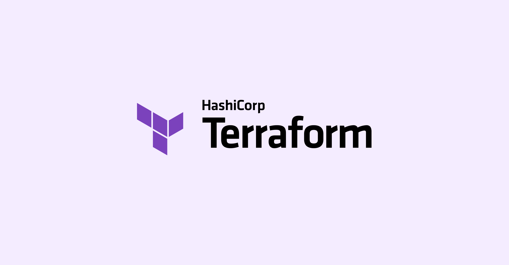

## How was Terraform built?

People think that Terraform was an original idea from Hashicorp. But it was not. The idea of Infra as Code was from AWS when Cloud Formation was introduced 
in the year 2011. Hashicorp took the idea and built Terraform. Terraform was first released in the year 2014. 

Hashimoto himself has said that Terraform was inspired by AWS Cloud Formation [here](https://www.hashicorp.com/resources/the-story-of-hashicorp-terraform-with-mitchell-hashimoto).
He says 
> "In 2011, AWS introduced CloudFormation ... But what I thought we really needed was an open source, cloud-agnostic solution ..."

## What is the new license?

On 11th August 2023, Hashicorp announced that they are changing the license of Terraform from Mozilla Public License (MPL) to Business Source License.
They published a blog post about the change [here](https://www.hashicorp.com/blog/hashicorp-adopts-business-source-license). 
This very confusing blog post made one thing clear, that Terraform will be free to use for individuals and all companies, even 
partners like microsoft and aws. But it will not be free for any company that competes with Hashicorp. 

> End users can continue to copy, modify, and redistribute the code for all non-commercial and commercial use, except where providing a competitive offering to HashiCorp. Partners can continue to build integrations for our joint customers. We will continue to work closely with the cloud service providers to ensure deep support for our mutual technologies. Customers of enterprise and cloud-managed HashiCorp products will see no change as well.

This seems to be a very fair position to take. But the problem is the vagueness or boundlessness of terms of the BSL. Effectively
making it a proprietary license of Hashicorp that they can change at any time.

## Don't listen to the person who is saying "Fork it"!

Now all the competitors of Hashicorp might be thinking of forking Terraform. A few days ago, a new open source fork of Terraform was created 
by [digger.dev](digger.dev) called OpenTerraform, but it was taken down in a day for unknown reasons.

The problem with forking Terraform is not Terraform but the providers. Terraform has a lot of providers that are built by the community and 
more importantly by the cloud providers themselves. 

And these providers are hosted in the hashicorp organization on github. They are still MPL licensed but what if Hashicorp decides to change
those licenses too?

## The question is what can be forked? 

What people confuse with is, terraform is an application to run HCL code written for infrastructure development. HCL is a different
github project and it is still MPL licensed.
Even if we create a tool that can read HCL and run it, Hashicorp can make HCL a proprietary language in the future. Adding 
a license to a language is not a new thing. Oracle has done it with Java. This too adds a lot of uncertainty to the forking of terraform.

## Another problem is the Terraform Registry

Terraform registry is a place where all the providers are hosted. Along with a lot of modules created by the community, companies and 
partners. This too has to be cloned and hosted somewhere else. 

## Competitors are stirring

The competitors of Hashicorp are stirring. They have created a [manifesto](https://opentf.org/). But it appears to be the very
thing that Hashicorp is trying to avoid with the new license change. I don't think Hashicorp will change their mind because of this.
And I am glad that they didn't call it *"mein terraform"*.

## What's the right thing to do?

    

**As a competitor:** Wait and watch, the only way for you is to wait for a change from Hashicorp. If they don't change, you can't do anything.

**As a developer:** I think HCL is a cool language with a parser and backend written in Go. But the design of the language has 
not evolved much in the direction of a pure platform engineering defacto. Mainly because of Hashicorp's aversion to competitors profiting.
So I do think forking HCL (along with terraform) and creating a new language that is more exciting and pledged to be open source is the right thing to do.