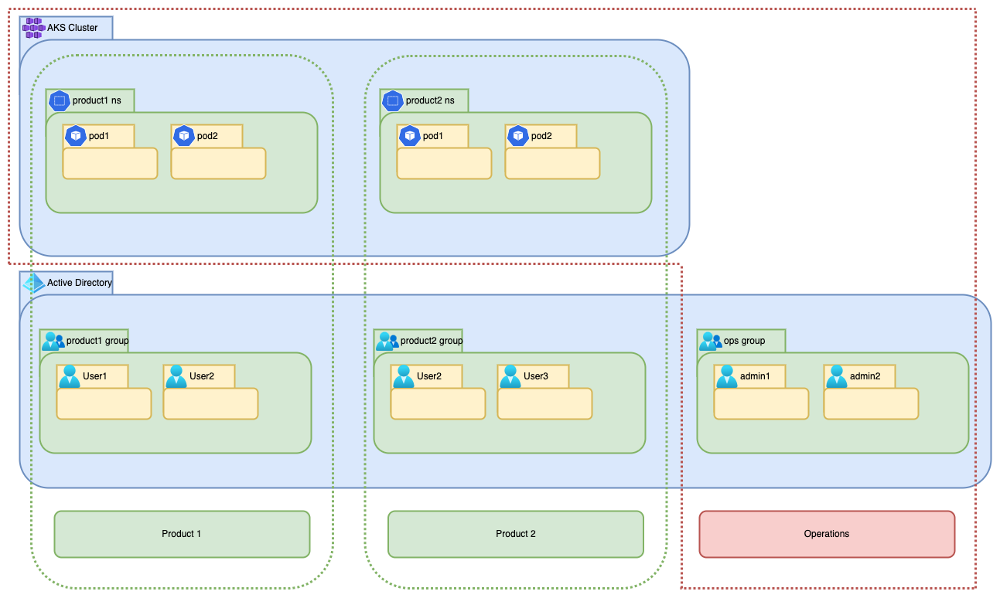

# AKS Security Practices | Access Control using RBAC with Terraform Code | Part 1

When you create an AKS cluster to be used by multiple developers from different product teams, access to the api server
has to be carefully managed. At the same time access should not be restrictive in any way, especially 
with respect to K8S. In this AKS series, we'll be looking at different operational solutions for AKS.

This first part will help you define a workflow for user access control to the api server as shown below. Example 
Terraform code is available for all configurations.

You can find the source code in this repository https://github.com/aravindarc/aks-access-control



## Cluster creation

:::caution

This code creates a public cluster with default network configurations. When you create a cluster, always create a 
private cluster with proper network configurations.

:::

```hcl title="./aks.tf"
resource "azurerm_kubernetes_cluster" "aks1" {
  name                = var.aks_name
  location            = azurerm_resource_group.aks-rg.location
  resource_group_name = azurerm_resource_group.aks-rg.name
  dns_prefix          = var.aks_dns_prefix

  default_node_pool {
    name       = "default"
    node_count = var.aks_default_node_pool_count
    vm_size    = var.aks_default_vm_size
  }

  azure_active_directory_role_based_access_control {
    managed                = true
    admin_group_object_ids = var.aks_admin_group_object_ids
    azure_rbac_enabled     = true
  }

  identity {
    type = "SystemAssigned"
  }
}

resource "azurerm_role_assignment" "admin" {
  for_each = toset(var.aks_admin_group_object_ids)
  scope = azurerm_kubernetes_cluster.aks1.id
  role_definition_name = "Azure Kubernetes Service Cluster User Role"
  principal_id = each.value
}

resource "azurerm_role_assignment" "namespace-groups" {
  for_each = toset(var.ad_groups)
  scope = azurerm_kubernetes_cluster.aks1.id
  role_definition_name = "Azure Kubernetes Service Cluster User Role"
  principal_id = azuread_group.groups[each.value].id
}
```

```hcl title="./resource-group.tf"
resource "azurerm_resource_group" "aks-rg" {
  name     = var.resource_group_name
  location = var.resource_group_location
}
```

```hcl title="./variables.tf"
variable "resource_group_name" {
  description = "resource group name"
  type        = string
}

variable "resource_group_location" {
  description = "resource group location"
  type        = string
}

variable "aks_name" {
  description = "aks name"
  type        = string
}

variable "aks_dns_prefix" {
  description = "aks dns prefix"
  type        = string
}

variable "aks_default_node_pool_count" {
  description = "aks default node pool count"
  type        = number
}

variable "aks_default_vm_size" {
  description = "aks default vm size"
  type        = string
}

variable "aks_admin_group_object_ids" {
  description = "aks admin group ids"
  type        = list(string)
}
```

```hcl title="./variables.tfvars"
resource_group_name         = "aks-resources"
resource_group_location     = "Central India"
aks_name                    = "aks1"
aks_dns_prefix              = "aks1"
aks_default_node_pool_count = 2
aks_default_vm_size         = "Standard_D2_v2"
aks_admin_group_object_ids  = ["00000000-0000-0000-0000-000000000000"]
```
The block `azure_active_directory_role_based_access_control` manages the cluster's rbac, the key `admin_group_object_ids`
is used to configure the ops group with admin access.

:::info

Whether it be admin access or restricted access, all principals have to be provided with `Azure Kubernetes Service 
Cluster User Role`. Only then the users will be able to list and get credentials of the cluster.

:::

## Groups Creation
We'll create one AD group per k8s namespace, users of the group will be given access to one particular Namespace in the 
AKS cluster.

Once the group is created we have to create a Role and RoleBinding with the subject as the AD group.

```hcl title="./group.tf"
data "azuread_client_config" "current" {}

resource "azuread_group" "groups" {
  for_each         = toset(var.ad_groups)
  display_name     = each.value
  owners           = [data.azuread_client_config.current.object_id]
  security_enabled = true
}
```

```hcl title="./variables.tf"
variable "ad_groups" {
  description = "ad groups to be used in aks rolebindings"
  type        = list(string)
}
```

```hcl title="./variables.tfvars"
ad_groups                   = ["product1", "product2"]
```

This will create the Azure AD groups, it is a good convention to use the same name for the AD group and the K8S 
Namespace.

## K8S Manifests

We have to create a Role and RoleBinding in the namespace. This K8S manifest cannot be added to the application specific
helm chart. This has to be executed with admin rights. I have used helm to install the 

```yaml title="./helm/templates/ns.yaml"
{{- range .Values.namespaces }}
apiVersion: v1
kind: Namespace
metadata:
  name: {{ .name }}
---
{{- end }}
```

```yaml title="./helm/templates/role.yaml"
{{- range .Values.namespaces }}
kind: Role
apiVersion: rbac.authorization.k8s.io/v1
metadata:
  name: {{ .name }}-user-full-access
  namespace: {{ .name }}
rules:
- apiGroups: ["", "extensions", "apps"]
  resources: ["*"]
  verbs: ["*"]
- apiGroups: ["batch"]
  resources:
  - jobs
  - cronjobs
  verbs: ["*"]
---
{{- end }}
```

```yaml title="./helm/templates/role-binding.yaml"
{{- range .Values.namespaces }}
kind: RoleBinding
apiVersion: rbac.authorization.k8s.io/v1
metadata:
  name: {{ .name }}-user-access
  namespace: {{ .name }}
roleRef:
  apiGroup: rbac.authorization.k8s.io
  kind: Role
  name: {{ .name }}-user-full-access
subjects:
- kind: Group
  namespace: {{ .name }}
  name: {{ .objectid }}
---
{{- end }}
```

:::tip

You can use terraform outputs to output the group names and their object-ids, and use it in helm command with `--set` flag to do a seamless
integration. Here I am just hard-coding the namespaces in the values.yaml.

:::

```yaml title="./helm/values.yaml"
namespaces:
  - name: "product1"
    objectid: "00000000-0000-0000-0000-000000000000"
  - name: "product2"
    objectid: "00000000-0000-0000-0000-000000000000"
```

Now you're all set. Add users to the appropriate product group and try accessing the cluster, below I am trying to 
access the product1 namespace using a service principal that I created and added into the product1 AD group.

```shell-session
> az login --service-principal -u 00000000-0000-0000-0000-000000000000 -p 'xxxxxxxxxxxxxxxxxxxxxxxxxxxxxxxxxxxxxxxx' --tenant 00000000-0000-0000-0000-000000000000 --allow-no-subscriptions
[
  {
    "cloudName": "AzureCloud",
    "homeTenantId": "00000000-0000-0000-0000-000000000000",
    "id": "00000000-0000-0000-0000-000000000000",
    "isDefault": true,
    "managedByTenants": [],
    "name": "Pay-As-You-Go",
    "state": "Enabled",
    "tenantId": "00000000-0000-0000-0000-000000000000",
    "user": {
      "name": "00000000-0000-0000-0000-000000000000",
      "type": "servicePrincipal"
    }
  }
]
> az aks get-credentials --resource-group aks-resources --name aks1 --overwrite-existing
Merged "aks1" as current context in /Users/aravindarc/.kube/config
> kubelogin remove-tokens
> kubelogin convert-kubeconfig -l azurecli
> kubectl get po -n product1
No resources found in product1 namespace.
```

But when I try to access something from default namespace, I will be blocked.

```shell-session
> kubectl get po -n default
Error from server (Forbidden): pods is forbidden: User "a82dff55-652b-46f5-8904-171f5813f4d2" cannot list resource "pods" in API group "" in the namespace "default": User does not have access to the resource in Azure. Update role assignment to allow access.
```

## Next Step

In the next tutorial we'll be covering the network level security measures that one should take with respect to AKS, 
hang on!