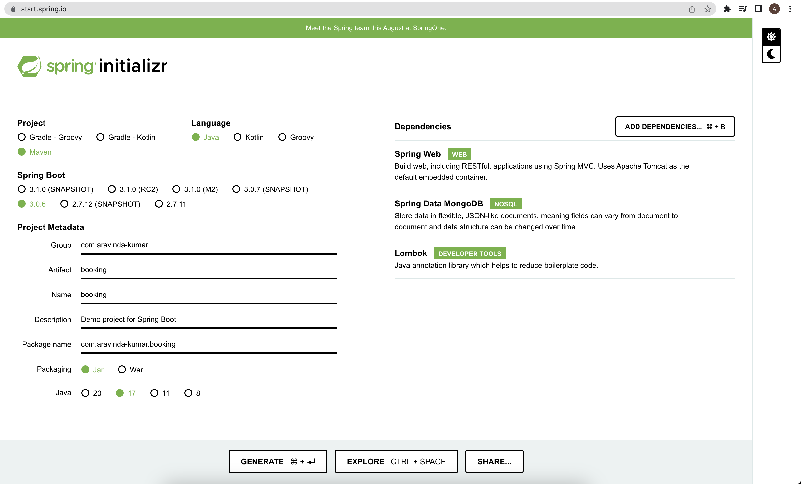

# How to implement filtering and pagination in Spring Boot (MongoDB)

In this tutorial I will explain how to implement filtering and pagination in Spring Boot. Implementing pagination
in spring boot is pretty straightforward using the `MongoRepository` interface, paginated methods just have to have a `Pageable`
function argument and `Page<?>` return type. 

The interesting part is the Filtering implementation. We will create a reusable component that can be fitted on any Repos
and provide Filtering for any field in your MongoDB Document with less boilerplate.

Find the complete code [here](https://github.com/aravindarc/spring-boot-filtering-pagination).

export const Highlight = ({children, color}) => (
    <span
        style={{
            backgroundColor: color,
            borderRadius: '2px',
            color: '#000',
            padding: '0.2rem',
        }}>
    {children}
  </span>
);

export const Filter = ({keey, operator, valuee}) => (
    <span>
        <Highlight color={"lightgreen"}>{keey}</Highlight>|<Highlight color={"lightblue"}>{operator}</Highlight>|<Highlight color="lightcoral">{valuee}</Highlight>
    </span>
)

## Create the Spring Boot Project on Spring Initializr

The configuration looks something like this 
Click [here](https://start.spring.io/#!type=maven-project&language=java&platformVersion=3.0.6&packaging=jar&jvmVersion=17&groupId=com.aravinda-kumar&artifactId=booking&name=booking&description=Demo%20project%20for%20Spring%20Boot&packageName=com.aravinda-kumar.booking&dependencies=web,data-mongodb,lombok) to open Initializr.

## The model for our tutorial
```java title=model/Booking.java
@Document("booking")
@Data
public class Booking {
    @Id private String id;
    private String name;
    private String email;
    private String phone;
    private LocalDateTime checkIn;
    private LocalDateTime checkOut;
    private int room;
    private String status;
    @CreatedDate private LocalDateTime createdAt;
}
```

## The Filter Query DSL

We are trying to keep the query DSL very simple, our GET request with filter will look something like this:
```
http://localhost:8080/api/booking?page=0&size=10&filter=createdAt|gte|2023-05-11T00:00
```

The filter parameter is of the form: <Filter keey={"key"} operator={"operator"} valuee={"value"}/>

What we have to do in the backend is parse this DSL and convert the operators into mongodb native operators.

### Filter Examples:
#### To find bookings created between two dates:

filter=<Filter keey={"createdAt"} operator={"gte"} valuee={"2023-05-11T00:00"}/>

filter=<Filter keey={"createdAt"} operator={"lte"} valuee={"2023-05-20T00:00"}/>

#### To search the name of user using regex:

filter=<Filter keey={"name"} operator={"regex"} valuee={"(?i)john"}/>

#### To find all the bookings of 1, 2, 3 rooms

filter=<Filter keey={"room"} operator={"in"} valuee={"1;2;3"}/>

:::danger
Here I have used the **|** symbol as the delimiter between the tokens for verbosity’s sake, it is unsafe to use this character.
According to IETF specifications in [RFC 3986](https://www.rfc-editor.org/rfc/rfc3986) this character is unsafe to use in a URL.
Use encoding or a different delimiter in your project.
:::

## Filterable Repository

We are trying to implement a Repository that can be extended by any base repo with any model. This repo contains three methods

1. To get all documents with pagination and filtering
2. To get all the values of a particular field in the document for populating choices in the UI
3. The third default method is to construct the Mongo query from the request params

```java title=repository/FilterableRepository.java
public interface FilterableRepository<T> {
    Page<T> findAllWithFilter(Class<T> typeParameterClass,
                              Filtering filtering, Pageable pageable);

    List<Object> getAllPossibleValuesForFilter(Class<T> typeParameterClass, Filtering filtering, String filterKey);

    default Query constructQueryFromFiltering(Filtering filtering) {
        Query query = new Query();
        Map<String, Criteria> criteriaMap = new HashMap<>();
        for (Filtering.Filter filter : filtering.getFilterList()) {
            switch (filter.operator) {
                case eq:
                    criteriaMap.put(filter.key, Criteria.where(filter.key).is(filter.value));
                    break;
                case gt:
                    if (criteriaMap.containsKey(filter.key)) {
                        criteriaMap.get(filter.key).gt(filter.value);
                    } else {
                        criteriaMap.put(filter.key, Criteria.where(filter.key).gt(filter.value));
                    }
                    break;
                case gte:
                    if (criteriaMap.containsKey(filter.key)) {
                        criteriaMap.get(filter.key).gte(filter.value);
                    } else {
                        criteriaMap.put(filter.key, Criteria.where(filter.key).gte(filter.value));
                    }
                    break;
                case in:
                    criteriaMap.put(filter.key, Criteria.where(filter.key).in((HashSet<Object>)filter.value));
                    break;
                case lt:
                    if (criteriaMap.containsKey(filter.key)) {
                        criteriaMap.get(filter.key).lt(filter.value);
                    } else {
                        criteriaMap.put(filter.key, Criteria.where(filter.key).lt(filter.value));
                    }
                    break;
                case lte:
                    if (criteriaMap.containsKey(filter.key)) {
                        criteriaMap.get(filter.key).lte(filter.value);
                    } else {
                        criteriaMap.put(filter.key, Criteria.where(filter.key).lte(filter.value));
                    }
                    break;
                case ne:
                    criteriaMap.put(filter.key, Criteria.where(filter.key).ne(filter.value));
                    break;
                case nin:
                    criteriaMap.put(filter.key, Criteria.where(filter.key).nin((HashSet<Object>)filter.value));
                    break;
                case regex:
                    criteriaMap.put(filter.key, Criteria.where(filter.key).regex((String)filter.value));
                    break;
                default:
                    throw new IllegalArgumentException("Unknown operator: " + filter.operator);
            }
        }
        criteriaMap.values().forEach(query::addCriteria);
        return query;
    }
}
```

```javajava title=repository/FilterableRepositoryImpl.java
@Repository
public class FilterableRepositoryImpl<T> implements FilterableRepository<T> {

    @Autowired
    private MongoTemplate mongoTemplate;

    @Override
    public Page<T> findAllWithFilter(Class<T> typeParameterClass, Filtering filtering, Pageable pageable) {
        Query query = constructQueryFromFiltering(filtering).with(pageable);
        List<T> ts = mongoTemplate.find(query, typeParameterClass);
        return PageableExecutionUtils.getPage(ts, pageable, () -> mongoTemplate.count(query, typeParameterClass));
    }

    @Override
    public List<Object> getAllPossibleValuesForFilter(Class<T> typeParameterClass, Filtering filtering, String filterKey) {
        Query query = constructQueryFromFiltering(filtering);
        return mongoTemplate.query(typeParameterClass).distinct(filterKey).matching(query).all();
    }
}
```

## The Filtering Class

```java title=repository/Filtering.java
@NoArgsConstructor
public class Filtering {
    List<Filter> filterList = new ArrayList<>();

    public void addFilter(String key, Operator operator, Object value) {
        filterList.add(new Filter(key, operator, value));
    }

    public List<Filter> getFilterList() {
        return filterList;
    }

    public enum Operator {
        eq("eq"),
        gt("gt"),
        gte("gte"),
        in("in"),
        lt("lt"),
        lte("lte"),
        ne("ne"),
        nin("nin"),
        regex("regex");

        private final String operator;

        Operator(String operator) {
            this.operator = operator;
        }

        @Override
        public String toString() {
            return this.operator;
        }

        public static Operator fromString(String operator) {
            for (Operator op : Operator.values()) {
                if (op.operator.equalsIgnoreCase(operator)) {
                    return op;
                }
            }
            return null;
        }
    }

    public class Filter {
        String key;
        Operator operator;
        Object value;

        public Filter(String key, Operator operator, Object value) {
            this.key = key;
            this.operator = operator;
            this.value = value;
        }

        public String getKey() {
            return key;
        }

        public Operator getOperator() {
            return operator;
        }

        public Object getValue() {
            return value;
        }

        @Override
        public String toString() {
            return getKey() + getOperator() + getValue();
        }
    }
}
```

```java title=repository/FilteringFactory.java
@NoArgsConstructor(access = lombok.AccessLevel.PRIVATE)
public class FilteringFactory {

    interface Converter {
        Object convert(String value);
    }

    private static final Map<Class, Converter> converterForClass = new HashMap<>();

    // add converters for all types that you want to support
    // keep it to primitive types, don't add converters for your own classes
    static {
        converterForClass.put(String.class, (value) -> value);
        converterForClass.put(Integer.class, Integer::valueOf);
        converterForClass.put(int.class, Integer::valueOf);
        converterForClass.put(long.class, Long::valueOf);
        converterForClass.put(Long.class, Long::valueOf);
        converterForClass.put(Double.class, Double::valueOf);
        converterForClass.put(double.class, Double::valueOf);
        converterForClass.put(Float.class, Float::valueOf);
        converterForClass.put(float.class, Float::valueOf);
        converterForClass.put(Boolean.class, Boolean::valueOf);
        converterForClass.put(boolean.class, Boolean::valueOf);
        converterForClass.put(LocalDateTime.class, LocalDateTime::parse);
    }

    public static <T> Filtering parseFromParams(List<String> filter, Class<T> typeParameterClass) {
        Filtering filtering = new Filtering();

        // a filter is in the format: key|operator|value
        for (String filterString : filter) {
            // first split by | to get the key, operator and value
            String[] filterSplit = filterString.split("\\|");

            // check if the filter is in the correct format
            if (filterSplit.length != 3) {
                throw new IllegalArgumentException("Filtering parameter is not in the correct format");
            }

            try {
                // parse the operator
                Filtering.Operator operator = Filtering.Operator.fromString(filterSplit[1]);

                // the key can be nested, so we split by . to get the nested keys
                // example1: key1.key2.key3 will result in nested = [key1, key2, key3]
                // example2: key1 will result in nested = [key1]
                String[] nested = filterSplit[0].split("\\.");

                // if the operator is "in" or "nin", we need to split the value by ; to get the list of values
                // "in" and nin are the only operators that can have multiple values
                // "in" checks if the value is in the list of values
                // "nin" checks if the value is not in the list of values
                if (operator == Filtering.Operator.in || operator == Filtering.Operator.nin) {
                    Set<Object> list = new HashSet<>();
                    for (String value : filterSplit[2].split(";")) {
                        list.add(nestedObject(typeParameterClass, value, nested));
                    }

                    // add the filter to the filtering object
                    filtering.addFilter(filterSplit[0], operator, list);
                } else {

                    // add the filter to the filtering object
                    filtering.addFilter(filterSplit[0], Filtering.Operator.fromString(filterSplit[1]),
                            nestedObject(typeParameterClass, filterSplit[2], nested));
                }
            } catch (NoSuchFieldException e) {
                throw new IllegalArgumentException("Filtering parameter not allowed: " + filterSplit[0]);
            } catch (IllegalAccessException e) {
                throw new RuntimeException(e);
            }
        }
        return filtering;
    }

    // this method uses recursion to get the last primitive type in the nested keys by travelling down the object tree
    // this recursion method is safe because in the worst case, the number of recursive calls is equal to the number of nested keys
    // in contradiction to the popular belief, recursion is not always bad and when you need to travel down an object tree, it is the best solution
    private static Object nestedObject(Class classParameter, String value, String[] nested) throws NoSuchFieldException, IllegalAccessException {
        Field field = classParameter.getDeclaredField(nested[0]);
        if (nested.length > 1) {
            // if there are more nested keys, we need to travel down the object tree
            // we do this by calling this method again by removing the first nested key and passing the type of the field
            // along with the value and the remaining nested keys
            return nestedObject(field.getType(), value, Arrays.copyOfRange(nested, 1, nested.length));
        }

        // when nested.length == 1, we have reached the last nested key
        // not only have reached the last nested key, but we also have the type of the field
        // using the type of the field, we can get the correct converter from the map and convert the value
        return Optional.of(converterForClass.get(field.getType()).convert(value)).orElseThrow(() ->
                new IllegalArgumentException("Filtering not supported for: ." + nested[0]));
    }
}
```

## Model Repository

Our Model repository has to extend the above-mentioned FilterableRepository, that's it!

```java title=repository/BookingRepository.java
public interface BookingRepo extends MongoRepository<Booking, String>, FilterableRepository<Booking> {}
```

## Pagination Implementation

First we have to create a response wrapper class for any Model

```java title=model/PaginatedResponse.java
@Builder
@Data
public class PaginatedResponse<T> {
    private int currentPage;
    private long totalItems;
    private int totalPages;
    private List<T> items;
    private boolean hasNext;
}
```

## Final Step

Finally we can use all these in our Controller or Service Class to get pagination and filtering

```java title=controller/BookingController.java
@RestController
@RequiredArgsConstructor
@RequestMapping("/api/booking")
public class BookingController {

    private final BookingRepo bookingRepo;

    @PostMapping
    public Booking createBooking(@RequestBody Booking booking) {
        return bookingRepo.save(booking);
    }

    @GetMapping
    public PaginatedResponse<Booking> getBookings(@RequestParam int page, @RequestParam int size, @RequestParam List<String> filter) {
        Pageable pageable = PageRequest.of(page, size);
        Page<Booking> all = bookingRepo.findAllWithFilter(Booking.class, FilteringFactory.parseFromParams(filter, Booking.class), pageable);
        return PaginatedResponse.<Booking>builder()
                .currentPage(all.getNumber())
                .totalItems(all.getTotalElements())
                .totalPages(all.getTotalPages())
                .items(all.getContent())
                .hasNext(all.hasNext())
                .build();
    }
}
```

## Let's test our app

### First we'll create few documents using the POST method

```
POST http://localhost:8080/api/booking
Content-Type: application/json
```
```json
{
  "name": "John Doe",
  "email": "johndoe@aravinda-kumar.com",
  "phone": "1234567890",
  "checkIn": "2023-05-20T12:00:00",
  "checkOut": "2023-05-30T11:59:59",
  "room": 1,
  "status": "booked"
}
```

---

```
POST http://localhost:8080/api/booking
Content-Type: application/json
```
```json
{
  "name": "Dennis Ritchie",
  "email": "dennisritchie@aravinda-kumar.com",
  "phone": "1234567890",
  "checkIn": "2023-05-22T12:00:00",
  "checkOut": "2023-05-25T11:59:59",
  "room": 3,
  "status": "booked"
}
```
---
```
POST http://localhost:8080/api/booking
Content-Type: application/json
```
```json
{
  "name": "Aravinda Kumar",
  "email": "aravind@aravinda-kumar.com",
  "phone": "1234567890",
  "checkIn": "2023-05-21T12:00:00",
  "checkOut": "2023-05-24T11:59:59",
  "room": 5,
  "status": "booked"
}
```

### Let's see our filtering and pagination implementation in action

#### 1. Find all bookings with name john

filter=<Filter keey={"name"} operator={"regex"} valuee={"(?i)john"}/>

```
GET http://localhost:8080/api/booking?page=0&size=10&filter=name|regex|(?i)john
```
```json
{
  "currentPage": 0,
  "totalItems": 1,
  "totalPages": 1,
  "items": [
    {
      "id": "645c19a093932a6d9f52577e",
      "name": "John Doe",
      "email": "johndoe@aravinda-kumar.com",
      "phone": "1234567890",
      "checkIn": "2023-05-20T12:00:00",
      "checkOut": "2023-05-30T11:59:59",
      "room": 1,
      "status": "booked",
      "createdAt": "2023-05-11T03:54:32.245"
    }
  ],
  "hasNext": false
}
```
---

#### 2. Find all occupied rooms between 23rd and 24th of May

filter=<Filter keey={"checkOut"} operator={"gte"} valuee={"2023-05-24T00:00"}/>

filter=<Filter keey={"checkIn"} operator={"lte"} valuee={"2023-05-23T00:00"}/>

```
GET http://localhost:8080/api/booking?page=0&size=10&filter=checkOut|gte|2023-05-24T00:00&filter=checkIn|lte|2023-05-23T00:00
```
```json
{
  "currentPage": 0,
  "totalItems": 3,
  "totalPages": 1,
  "items": [
    {
      "id": "645c19a093932a6d9f52577e",
      "name": "John Doe",
      "email": "johndoe@aravinda-kumar.com",
      "phone": "1234567890",
      "checkIn": "2023-05-20T12:00:00",
      "checkOut": "2023-05-30T11:59:59",
      "room": 1,
      "status": "booked",
      "createdAt": "2023-05-11T03:54:32.245"
    },
    {
      "id": "645c19ad93932a6d9f52577f",
      "name": "Dennis Ritchie",
      "email": "dennisritchie@aravinda-kumar.com",
      "phone": "1234567890",
      "checkIn": "2023-05-22T12:00:00",
      "checkOut": "2023-05-25T11:59:59",
      "room": 3,
      "status": "booked",
      "createdAt": "2023-05-11T03:54:45.856"
    },
    {
      "id": "645c1dd76f0e4d106c3b405a",
      "name": "Aravinda Kumar",
      "email": "aravind@aravinda-kumar.com",
      "phone": "1234567890",
      "checkIn": "2023-05-21T12:00:00",
      "checkOut": "2023-05-24T11:59:59",
      "room": 5,
      "status": "booked",
      "createdAt": "2023-05-11T04:12:31.749"
    }
  ],
  "hasNext": false
}
```
---

#### 3. Find all bookings in 1, 2 and 3 room between 23rd and 24th of May

filter=<Filter keey={"room"} operator={"in"} valuee={"1;2;3"}/>

filter=<Filter keey={"checkOut"} operator={"gte"} valuee={"2023-05-24T00:00"}/>

filter=<Filter keey={"checkIn"} operator={"lte"} valuee={"2023-05-23T00:00"}/>

```
GET http://localhost:8080/api/booking?page=0&size=10&filter=room|in|1;2;3&filter=checkOut|gte|2023-05-24T00:00&filter=checkIn|lte|2023-05-23T00:00
```
```json
{
  "currentPage": 0,
  "totalItems": 2,
  "totalPages": 1,
  "items": [
    {
      "id": "645c19a093932a6d9f52577e",
      "name": "John Doe",
      "email": "johndoe@aravinda-kumar.com",
      "phone": "1234567890",
      "checkIn": "2023-05-20T12:00:00",
      "checkOut": "2023-05-30T11:59:59",
      "room": 1,
      "status": "booked",
      "createdAt": "2023-05-11T03:54:32.245"
    },
    {
      "id": "645c19ad93932a6d9f52577f",
      "name": "Dennis Ritchie",
      "email": "dennisritchie@aravinda-kumar.com",
      "phone": "1234567890",
      "checkIn": "2023-05-22T12:00:00",
      "checkOut": "2023-05-25T11:59:59",
      "room": 3,
      "status": "booked",
      "createdAt": "2023-05-11T03:54:45.856"
    }
  ],
  "hasNext": false
}
```


## Conclusion

With just a few lines of code we have created a reusable component, providing advanced querying functionality to our APIs.
In the next tutorial I will show how to create a reusable table component in React that can use this API.
Find the complete code [here](https://github.com/aravindarc/spring-boot-filtering-pagination).